# README

This README would normally document whatever steps are necessary to get the
application up and running.

A single page Secured Settings App of customer for Enterprise cloud Product.
Customers can able to configure more than one module in the settings page.
Each module contains more than one user preference or configurations.

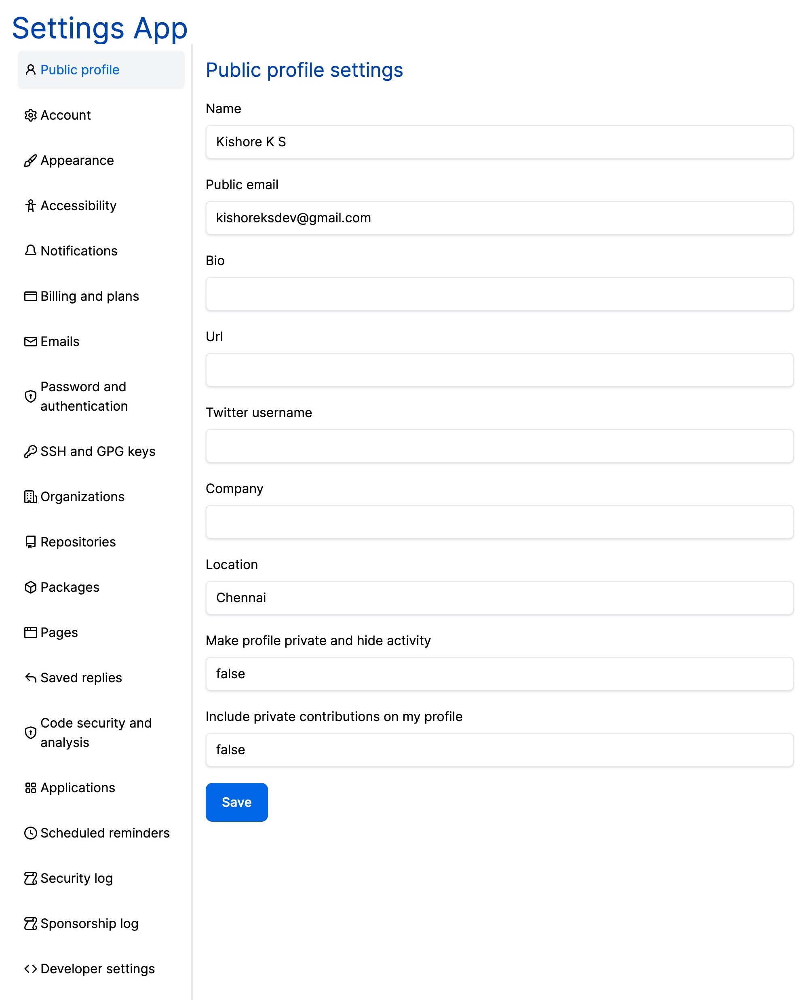


# API Guide

### Add new settings 
```bash
Route: settings.json
Method: POST
Content-Type: 'application/json'
AUTH: No Auth

curl --location --request POST 'http://localhost:3000/settings.json' \
--header 'Content-Type: application/json' \
--data-raw '{
    "name": "Security Log Event",
    "settings": {
        "name": "Kishore K S"
    }
}'
```

### Update settings
```bash
Route: settings/{settings_app_name}.json
Method: PUT
Content-Type: 'application/json'
AUTH: No Auth

curl --location --request PUT 'http://localhost:3000/settings/security-log-event.json' \
--header 'Content-Type: application/json' \
--data-raw '{
    "name": "Security Log Event1",
    "settings": {
        "name": "Kishore K S"
    }
}'
```

### Delete settings

```bash
Route: settings/{settings_app_name}.json
Method: DELETE
Content-Type: 'application/json'
AUTH: No Auth
Return Response: 204 NO-CONTENT

curl --location --request DELETE 'http://localhost:3000/settings/security-log-event.json' 
```

### Get settings for public-profile

```bash
Route: settings/public-profile.json
Method: GET
Content-Type: 'application/json'
AUTH: No Auth

curl --location --request GET 'http://localhost:3000/settings/public-profile.json'
```

Response:
```bash
{
    "Public profile": "{'name': 'Kishore K S','public_email': 'kishoreksdev@gmail.com','bio': '','url': '','twitter_username': '','company': '','location': 'Chennai','make_profile_private_and_hide_activity': 'false','include_private_contributions_on_my_profile': 'false'}"
}
```

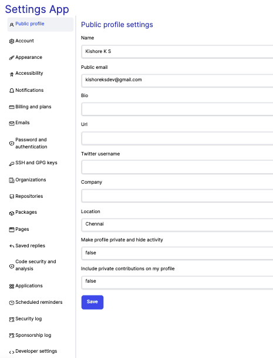


### Get settings for Account

```bash
Route: settings/account.json
Method: GET
Content-Type: 'application/json'
AUTH: No Auth

curl --location --request GET 'http://localhost:3000/settings/account.json'
```

Response:
```bash
{
    "Account":"{'change_username': '','start_export': '','successor': '','delete_account': ''}"
}    
```

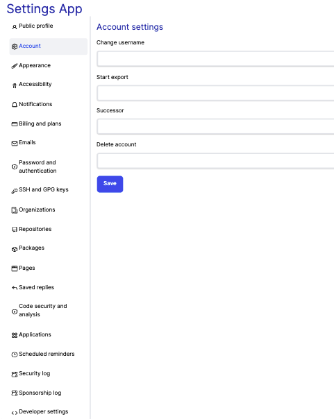


### Get settings for Appearance

```bash
Route: settings/appearance.json
Method: GET
Content-Type: 'application/json'
AUTH: No Auth

curl --location --request GET 'http://localhost:3000/settings/appearance.json'
```

Response:
```bash
{
    "Appearance":"{'theme_mode': 'Sync with system','preferred_default_emoji_skin_tone': '','choose_the_number_of_spaces_a_tab_is_equal_to_when_rendering_code': '8 (Default)','use_a_fixed-width_(monospace)_font_when_editing_Markdown': ''}"
}    
```

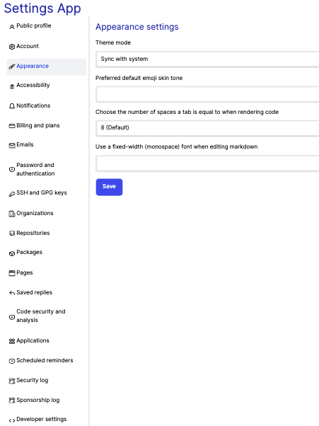


### Get settings for Accessibility

```bash
Route: settings/accessibility.json
Method: GET
Content-Type: 'application/json'
AUTH: No Auth

curl --location --request GET 'http://localhost:3000/settings/accessibility.json'
```

Response:
```bash
{
    "Accessibility":"{'character_keys': '','search_mode': 'command + k or command + alt _ k (default)','command_mode': 'command + shifft + k (default)','sync_with_system': 'true','enabled': 'false','disabled': 'true'}"
}    
```

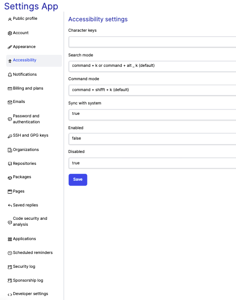


### Get settings for Notifications

```bash
Route: settings/notifications.json
Method: GET
Content-Type: 'application/json'
AUTH: No Auth

curl --location --request GET 'http://localhost:3000/settings/notifications.json'
```

Response:
```bash
{
    "Notifications":"{\n                      'automatically_watch_repositories': 'true',\n                      'automatically_watch_teams': 'true',\n                      'participating_email': 'true',\n                      'participating_web_and_mobile': 'true',\n                      'watching_email': 'true',\n                      'watching_web_mobile': 'true',\n                      'dependabot_alerts_ui_alerts': 'true',\n                      'dependabot_alerts_commmand_line': 'true',\n                      'dependabot_alerts_web': 'true',\n                      'email_each_time_a_vulnerability_is_found': 'true',\n                      'email_a_digest_summary_of_vulnerabilities': 'false',\n                      'actions_email': 'true',\n                      'actions_web': 'false',\n                      'send_notifications_for_failed_workflows_only': 'true',\n                      'organization_alerts_email': 'true',\n                      'default_notification_email': '',\n                      'comments_on_issues_and_pull_requests': 'true',\n                      'pull_request_reviews': 'true',\n                      'pull_request_pushes': 'true',\n                      'include_your_own_updates': 'false'\n                  }"
}    
```

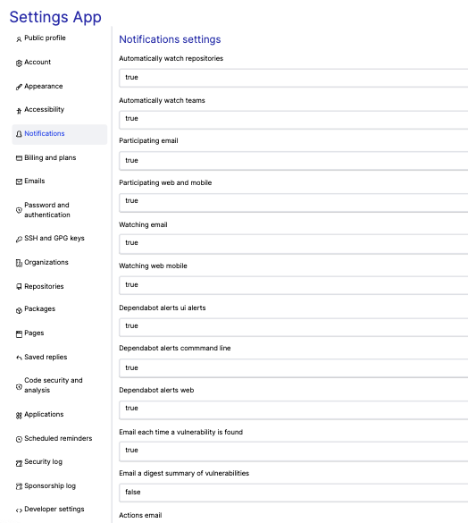


### Get settings for Billing and plans

```bash
Route: settings/billing-and-plans.json
Method: GET
Content-Type: 'application/json'
AUTH: No Auth

curl --location --request GET 'http://localhost:3000/settings/billing-and-plans.json'
```

Response:
```bash
{
    "Billing and plans":"{\n                      'current_plan': 'GitHub Free'\n                    }"
}    
```

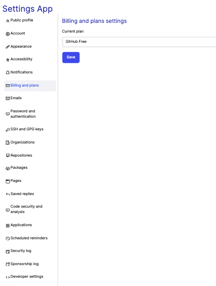


### Get settings for Emails

```bash
Route: settings/emails.json
Method: GET
Content-Type: 'application/json'
AUTH: No Auth

curl --location --request GET 'http://localhost:3000/settings/emails.json'
```

Response:
```bash
{
    "Emails":"{\n                      'add_email_address': '',\n                      'primary_email_address': 'kishoreksdev@gmail.com',\n                      'backup_email_address': 'Allow all verified emails',\n                      'keep_my_email_addresses_private': 'false',\n                      'receive_all_emails_except_those_i_unsubscribe_from': 'false',\n                      'only_receive_account_related_emails_and_those_i_subscribe_to': 'true'\n                    }"
}    
```

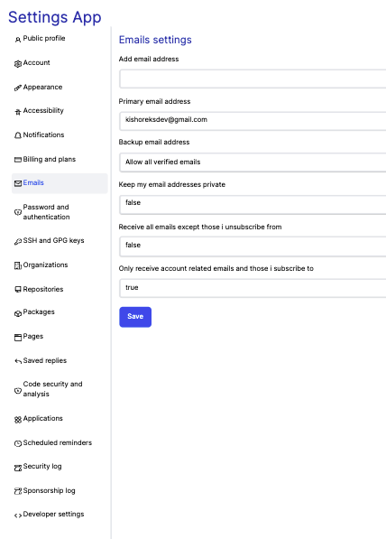


### Get settings for Password and authentication

```bash
Route: settings/password-and-authentication.json
Method: GET
Content-Type: 'application/json'
AUTH: No Auth

curl --location --request GET 'http://localhost:3000/settings/password-and-authentication.json'
```

Response:
```bash
{
    "Password and authentication":"{\n                      'old_password': '',\n                      'new_password': '',\n                      'confirm_new_password': ''\n                    }"
}    
```

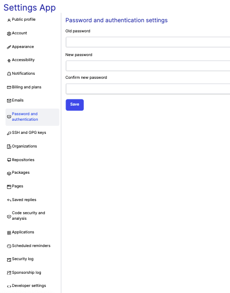


### Get settings for SSH and GPG keys

```bash
Route: settings/ssh-and-gpg-keys.json
Method: GET
Content-Type: 'application/json'
AUTH: No Auth

curl --location --request GET 'http://localhost:3000/settings/ssh-and-gpg-keys.json'
```

Response:
```bash
{
    "SSH and GPG keys":"{\n                      'flag_unsigned_commits_as_unverified': 'false'\n                    }"
}    
```

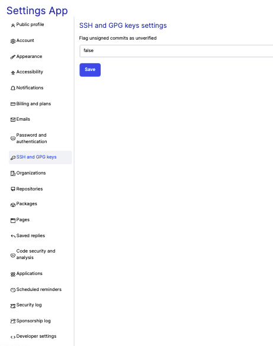


### Get settings for Organizations

```bash
Route: settings/organizations.json
Method: GET
Content-Type: 'application/json'
AUTH: No Auth

curl --location --request GET 'http://localhost:3000/settings/organizations.json'
```

Response:
```bash
{
    "Organizations":"{\n                      'transform_account': ''\n                    }"
}    
```

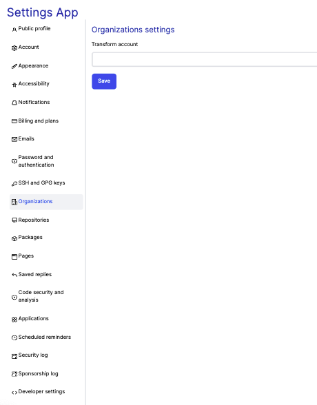


### Get settings for Repositories

```bash
Route: settings/repositories.json
Method: GET
Content-Type: 'application/json'
AUTH: No Auth

curl --location --request GET 'http://localhost:3000/settings/repositories.json'
```

Response:
```bash
{
    "Repositories":"{\n                      'default_branch': 'main',\n                      'repositories': ''\n                    }"
}    
```

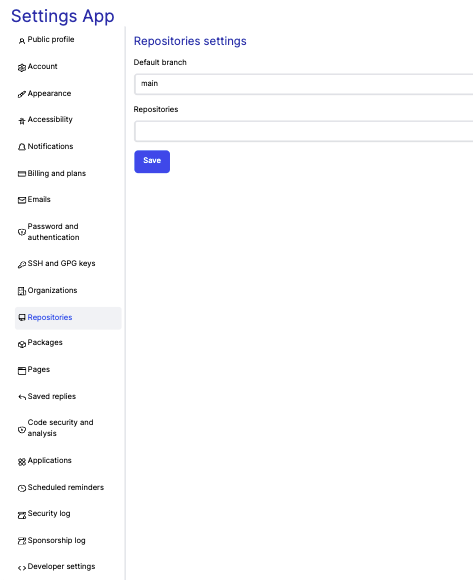


### Get settings for Packages

```bash
Route: settings/packages.json
Method: GET
Content-Type: 'application/json'
AUTH: No Auth

curl --location --request GET 'http://localhost:3000/settings/packages.json'
```

Response:
```bash
{
    "Packages":"{\n                      'deleted_repositories': ''\n                    }"
}    
```


### Get settings for Pages

```bash
Route: settings/pages.json
Method: GET
Content-Type: 'application/json'
AUTH: No Auth

curl --location --request GET 'http://localhost:3000/settings/pages.json'
```

Response:
```bash
{
    "Pages":"{\n                      'verified_domain': ''\n                    }"
}    
```

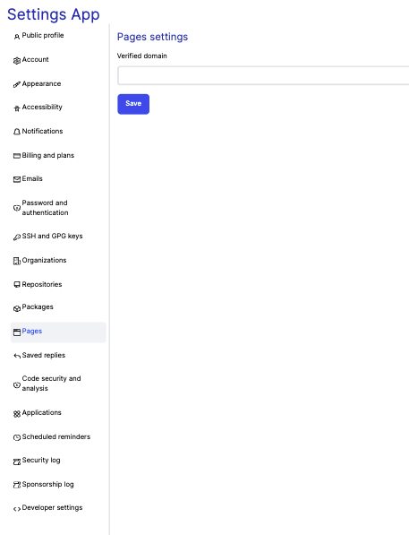


### Get settings for Saved replies

```bash
Route: settings/saved-replies.json
Method: GET
Content-Type: 'application/json'
AUTH: No Auth

curl --location --request GET 'http://localhost:3000/settings/saved-replies.json'
```

Response:
```bash
{
    "Saved replies":"{\n                      'saved_reply': ''\n                    }"
}    
```

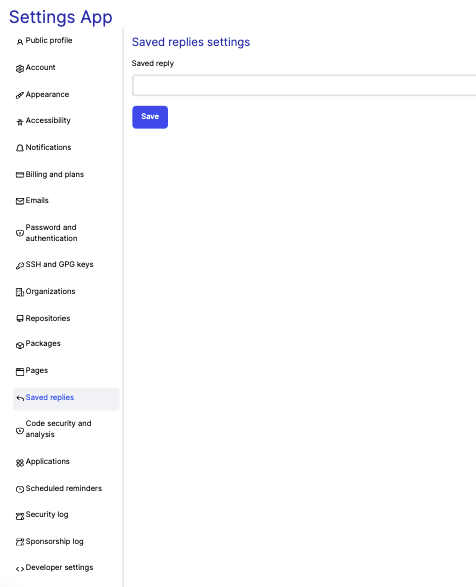


### Get settings for Code security and analysis

```bash
Route: settings/code-security-and-analysis.json
Method: GET
Content-Type: 'application/json'
AUTH: No Auth

curl --location --request GET 'http://localhost:3000/settings/code-security-and-analysis.json'
```

Response:
```bash
{
    "Code security and analysis":"{\n                      'automatically_enable_for_new_private_repositories': 'false',\n                      'automatically_enable_for_new_repositories': 'false',\n                      'automatically_enable_for_new_repositories': 'false'\n                    }"
}    
```

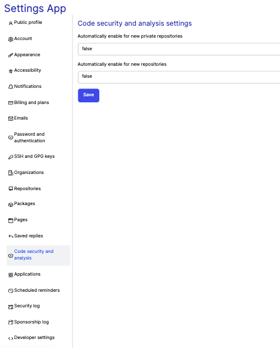


### Get settings for Applications

```bash
Route: settings/applications.json
Method: GET
Content-Type: 'application/json'
AUTH: No Auth

curl --location --request GET 'http://localhost:3000/settings/applications.json'
```

Response:
```bash
{
    "Applications":"{\n                      'installed_github_apps': '',\n                      'authorized_github_apps': '',\n                      'authorized_oauth_apps': ''\n                    }"
}    
```

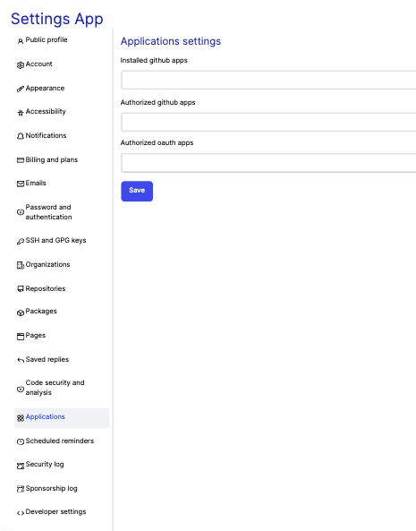


### Get settings for Scheduled reminders

```bash
Route: settings/scheduled-reminders.json
Method: GET
Content-Type: 'application/json'
AUTH: No Auth

curl --location --request GET 'http://localhost:3000/settings/scheduled-reminders.json'
```

Response:
```bash
{
    "Scheduled reminders":"{\n                      'scheduled_reminders': ''\n                    }"
}    
```

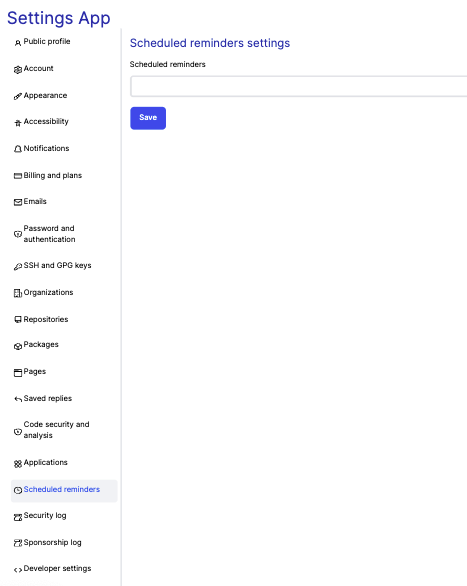


### Get settings for Security log

```bash
Route: settings/security-log.json
Method: GET
Content-Type: 'application/json'
AUTH: No Auth

curl --location --request GET 'http://localhost:3000/settings/security-log.json'
```

Response:
```bash
{
    "Security log":"{\n                      'security_logs': ''\n                    }"
}    
```

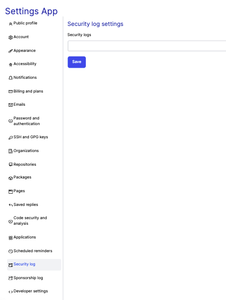


### Get settings for Sponsorship log

```bash
Route: settings/sponsorship-log.json
Method: GET
Content-Type: 'application/json'
AUTH: No Auth

curl --location --request GET 'http://localhost:3000/settings/sponsorship-log.json'
```

Response:
```bash
{
    "Sponsorship log":"{\n                      'sponsorship_logs': ''\n                    }"
}    
```

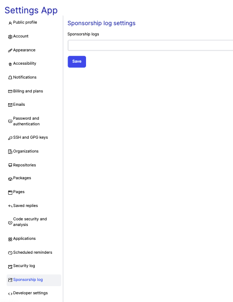


### Get settings for Developer settings

```bash
Route: settings/developer-settings.json
Method: GET
Content-Type: 'application/json'
AUTH: No Auth

curl --location --request GET 'http://localhost:3000/settings/developer-settings.json'
```

Response:
```bash
{
    "Developer settings":"{\n                      'github_apps': ''\n                    }"
}    
```

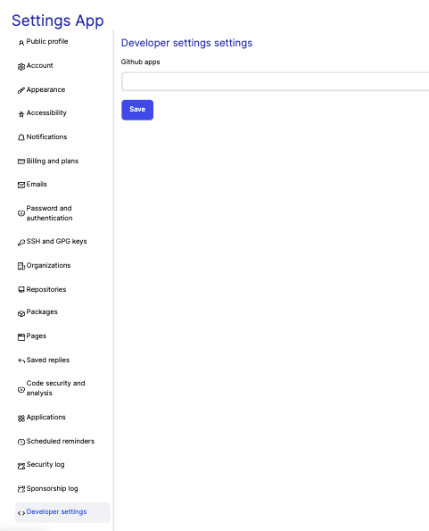

