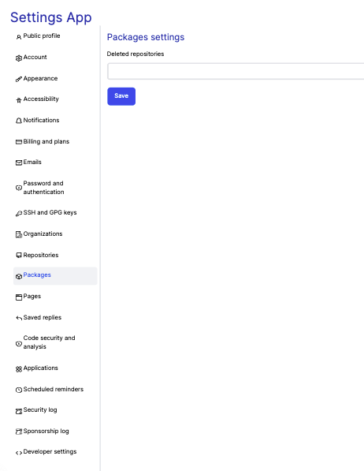

# Settings App

The Secured Settings App designed as a Single page Application (SPA) which provides a rich experience to the customer,
the interaction with the web navigation dynamically rewrites the page
and fetch new contents from the web server seamlessly. This will provide enterprise level app experience to the end user.
This app contains various modules providing user accessibility to the customers.
Customers can configure the module settings rapidly by negating the need of full page reloads.
Each module contains more than one user preference or configurations and these configurations are mutable.
Modified changes reflect in the settings page effortlessly by the action of RESTful API's.

## Example

Here is an example of the settings page, which represents the configuration of the public-profile module is as shown below : 


# API Guide

REST APIs (Representational State Transfer) primarily use HTTP requests to do the following:

GET – Retrieve the resource.

PUT/PATCH – Update resource.

POST – Create a resource.

DELETE – Delete resource.

### Add new settings

To create new settings module in the settings page, please use the curl command with valid parameters and values as shown below:

```bash
Route: settings.json
Method: POST
Content-Type: 'application/json'
AUTH: No Auth

curl --location --request POST 'http://localhost:3000/settings.json' \
--header 'Content-Type: application/json' \
--data-raw '{
    "name": "Security Log Event",
    "settings": {
        "name": "Kishore K S"
    }
}'
```

### Update settings

To modify the existing settings module in the settings page, we use the curl command with modified value as shown below: 

```bash
Route: settings/{settings_app_name}.json
Method: PUT
Content-Type: 'application/json'
AUTH: No Auth

curl --location --request PUT 'http://localhost:3000/settings/security-log-event.json' \
--header 'Content-Type: application/json' \
--data-raw '{
    "name": "Security Log Event1",
    "settings": {
        "name": "Kishore K S"
    }
}'
```

### Delete settings

To delete the settings module, we use the curl command as shown below:

```bash
Route: settings/{settings_app_name}.json
Method: DELETE
Content-Type: 'application/json'
AUTH: No Auth
Return Response: 204 NO-CONTENT

curl --location --request DELETE 'http://localhost:3000/settings/security-log-event.json' 
```

### Get settings for public-profile

To display the public-profile module under the settings page, run the following curl command in a single line. 

```bash
Route: settings/public-profile.json
Method: GET
Content-Type: 'application/json'
AUTH: No Auth

curl --location --request GET 'http://localhost:3000/settings/public-profile.json'
```

Response:
```bash
{
    "Public profile": "{'name': 'Kishore K S','public_email': 'kishoreksdev@gmail.com','bio': '','url': '','twitter_username': '','company': '','location': 'Chennai','make_profile_private_and_hide_activity': 'false','include_private_contributions_on_my_profile': 'false'}"
}
```


### Get settings for Account

To display the Account module under the settings page, run the following curl command in a single line.

```bash
Route: settings/account.json
Method: GET
Content-Type: 'application/json'
AUTH: No Auth

curl --location --request GET 'http://localhost:3000/settings/account.json'
```

Response:
```bash
{
    "Account":"{'change_username': '','start_export': '','successor': '','delete_account': ''}"
}    
```


### Get settings for Appearance

To display the Appearance module under the settings page, run the following curl command in a single line.


```bash
Route: settings/appearance.json
Method: GET
Content-Type: 'application/json'
AUTH: No Auth

curl --location --request GET 'http://localhost:3000/settings/appearance.json'
```

Response:
```bash
{
    "Appearance":"{'theme_mode': 'Sync with system','preferred_default_emoji_skin_tone': '','choose_the_number_of_spaces_a_tab_is_equal_to_when_rendering_code': '8 (Default)','use_a_fixed-width_(monospace)_font_when_editing_Markdown': ''}"
}    
```


### Get settings for Accessibility

To display the Accessibility module under the settings page, run the following curl command in a single line.


```bash
Route: settings/accessibility.json
Method: GET
Content-Type: 'application/json'
AUTH: No Auth

curl --location --request GET 'http://localhost:3000/settings/accessibility.json'
```

Response:
```bash
{
    "Accessibility":"{'character_keys': '','search_mode': 'command + k or command + alt _ k (default)','command_mode': 'command + shifft + k (default)','sync_with_system': 'true','enabled': 'false','disabled': 'true'}"
}    
```


### Get settings for Notifications

To display the Notifications module under the settings page, run the following curl command in a single line.


```bash
Route: settings/notifications.json
Method: GET
Content-Type: 'application/json'
AUTH: No Auth

curl --location --request GET 'http://localhost:3000/settings/notifications.json'
```

Response:
```bash
{
    "Notifications":"{\n                      'automatically_watch_repositories': 'true',\n                      'automatically_watch_teams': 'true',\n                      'participating_email': 'true',\n                      'participating_web_and_mobile': 'true',\n                      'watching_email': 'true',\n                      'watching_web_mobile': 'true',\n                      'dependabot_alerts_ui_alerts': 'true',\n                      'dependabot_alerts_commmand_line': 'true',\n                      'dependabot_alerts_web': 'true',\n                      'email_each_time_a_vulnerability_is_found': 'true',\n                      'email_a_digest_summary_of_vulnerabilities': 'false',\n                      'actions_email': 'true',\n                      'actions_web': 'false',\n                      'send_notifications_for_failed_workflows_only': 'true',\n                      'organization_alerts_email': 'true',\n                      'default_notification_email': '',\n                      'comments_on_issues_and_pull_requests': 'true',\n                      'pull_request_reviews': 'true',\n                      'pull_request_pushes': 'true',\n                      'include_your_own_updates': 'false'\n                  }"
}    
```


### Get settings for Billing and plans

To display the Billing-and-plans module under the settings page, run the following curl command in a single line.

```bash
Route: settings/billing-and-plans.json
Method: GET
Content-Type: 'application/json'
AUTH: No Auth

curl --location --request GET 'http://localhost:3000/settings/billing-and-plans.json'
```

Response:
```bash
{
    "Billing and plans":"{\n                      'current_plan': 'GitHub Free'\n                    }"
}    
```


### Get settings for Emails

To display the Emails module under the settings page, run the following curl command in a single line.

```bash
Route: settings/emails.json
Method: GET
Content-Type: 'application/json'
AUTH: No Auth

curl --location --request GET 'http://localhost:3000/settings/emails.json'
```

Response:
```bash
{
    "Emails":"{\n                      'add_email_address': '',\n                      'primary_email_address': 'kishoreksdev@gmail.com',\n                      'backup_email_address': 'Allow all verified emails',\n                      'keep_my_email_addresses_private': 'false',\n                      'receive_all_emails_except_those_i_unsubscribe_from': 'false',\n                      'only_receive_account_related_emails_and_those_i_subscribe_to': 'true'\n                    }"
}    
```


### Get settings for Password and authentication

To display the Password-and-authentication module under the settings page, run the following curl command in a single line.

```bash
Route: settings/password-and-authentication.json
Method: GET
Content-Type: 'application/json'
AUTH: No Auth

curl --location --request GET 'http://localhost:3000/settings/password-and-authentication.json'
```

Response:
```bash
{
    "Password and authentication":"{\n                      'old_password': '',\n                      'new_password': '',\n                      'confirm_new_password': ''\n                    }"
}    
```


### Get settings for SSH and GPG keys

To display the SSH-and-GPG-keys module under the settings page, run the following curl command in a single line.

```bash
Route: settings/ssh-and-gpg-keys.json
Method: GET
Content-Type: 'application/json'
AUTH: No Auth

curl --location --request GET 'http://localhost:3000/settings/ssh-and-gpg-keys.json'
```

Response:
```bash
{
    "SSH and GPG keys":"{\n                      'flag_unsigned_commits_as_unverified': 'false'\n                    }"
}    
```


### Get settings for Organizations

To display the Organizations module under the settings page, run the following curl command in a single line.

```bash
Route: settings/organizations.json
Method: GET
Content-Type: 'application/json'
AUTH: No Auth

curl --location --request GET 'http://localhost:3000/settings/organizations.json'
```

Response:
```bash
{
    "Organizations":"{\n                      'transform_account': ''\n                    }"
}    
```


### Get settings for Repositories

To display the Repositories module under the settings page, run the following curl command in a single line.

```bash
Route: settings/repositories.json
Method: GET
Content-Type: 'application/json'
AUTH: No Auth

curl --location --request GET 'http://localhost:3000/settings/repositories.json'
```

Response:
```bash
{
    "Repositories":"{\n                      'default_branch': 'main',\n                      'repositories': ''\n                    }"
}    
```


### Get settings for Packages

To display the Packages module under the settings page, run the following curl command in a single line.

```bash
Route: settings/packages.json
Method: GET
Content-Type: 'application/json'
AUTH: No Auth

curl --location --request GET 'http://localhost:3000/settings/packages.json'
```

Response:
```bash
{
    "Packages":"{\n                      'deleted_repositories': ''\n                    }"
}    
```




### Get settings for Pages

To display the Pages module under the settings page, run the following curl command in a single line.

```bash
Route: settings/pages.json
Method: GET
Content-Type: 'application/json'
AUTH: No Auth

curl --location --request GET 'http://localhost:3000/settings/pages.json'
```

Response:
```bash
{
    "Pages":"{\n                      'verified_domain': ''\n                    }"
}    
```


### Get settings for Saved replies

To display the Saved-replies module under the settings page, run the following curl command in a single line.

```bash
Route: settings/saved-replies.json
Method: GET
Content-Type: 'application/json'
AUTH: No Auth

curl --location --request GET 'http://localhost:3000/settings/saved-replies.json'
```

Response:
```bash
{
    "Saved replies":"{\n                      'saved_reply': ''\n                    }"
}    
```


### Get settings for Code security and analysis

To display the Code-security-and-analysis module under the settings page, run the following curl command in a single line.

```bash
Route: settings/code-security-and-analysis.json
Method: GET
Content-Type: 'application/json'
AUTH: No Auth

curl --location --request GET 'http://localhost:3000/settings/code-security-and-analysis.json'
```

Response:
```bash
{
    "Code security and analysis":"{\n                      'automatically_enable_for_new_private_repositories': 'false',\n                      'automatically_enable_for_new_repositories': 'false',\n                      'automatically_enable_for_new_repositories': 'false'\n                    }"
}    
```


### Get settings for Applications

To display the Applications module under the settings page, run the following curl command in a single line.

```bash
Route: settings/applications.json
Method: GET
Content-Type: 'application/json'
AUTH: No Auth

curl --location --request GET 'http://localhost:3000/settings/applications.json'
```

Response:
```bash
{
    "Applications":"{\n                      'installed_github_apps': '',\n                      'authorized_github_apps': '',\n                      'authorized_oauth_apps': ''\n                    }"
}    
```


### Get settings for Scheduled reminders

To display the Scheduled-reminders module under the settings page, run the following curl command in a single line.

```bash
Route: settings/scheduled-reminders.json
Method: GET
Content-Type: 'application/json'
AUTH: No Auth

curl --location --request GET 'http://localhost:3000/settings/scheduled-reminders.json'
```

Response:
```bash
{
    "Scheduled reminders":"{\n                      'scheduled_reminders': ''\n                    }"
}    
```


### Get settings for Security log

To display the Security-log module under the settings page, run the following curl command in a single line.

```bash
Route: settings/security-log.json
Method: GET
Content-Type: 'application/json'
AUTH: No Auth

curl --location --request GET 'http://localhost:3000/settings/security-log.json'
```

Response:
```bash
{
    "Security log":"{\n                      'security_logs': ''\n                    }"
}    
```


### Get settings for Sponsorship log

To display the Sponsorship-log module under the settings page, run the following curl command in a single line.

```bash
Route: settings/sponsorship-log.json
Method: GET
Content-Type: 'application/json'
AUTH: No Auth

curl --location --request GET 'http://localhost:3000/settings/sponsorship-log.json'
```

Response:
```bash
{
    "Sponsorship log":"{\n                      'sponsorship_logs': ''\n                    }"
}    
```


### Get settings for Developer settings

To display the Developer-settings module under the settings page, run the following curl command in a single line.

```bash
Route: settings/developer-settings.json
Method: GET
Content-Type: 'application/json'
AUTH: No Auth

curl --location --request GET 'http://localhost:3000/settings/developer-settings.json'
```

Response:
```bash
{
    "Developer settings":"{\n                      'github_apps': ''\n                    }"
}    
```


